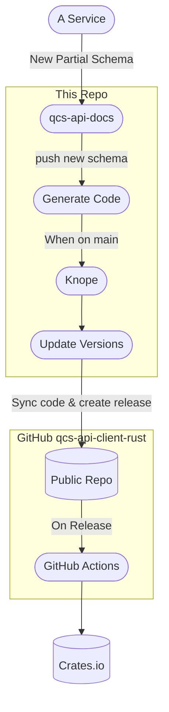

# Rust OpenAPI Client Generator

This project generates two Rust clients—one for each OpenAPI schema (public and internal). New clients are generated automatically when the [qcs-api-docs] repo is updated.

To generate manually:

```
make regenerate
```

## The Public Code

The source code for the public version of the client is available [on GitHub](https://github.com/rigetti/qcs-api-client-rust) for the convenience of consumers and to give a place for users to open issues. **No commits should ever be made against GitHub** as they will be overwritten by this repository on release during CI. The process of updating the public code looks like this:



[qcs-api-docs]: https://gitlab.com/rigetti/qcs/utilities/qcs-api-docs