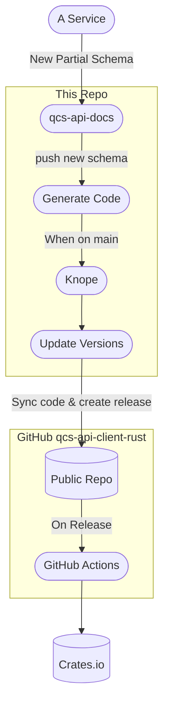

# Rust OpenAPI Client Generator

This project generates two Rust clients—one for each OpenAPI schema (public and internal). New schemas are updated automatically when the [qcs-api-docs] repo is updated.

Regenerate clients manually by running `make regenerate` from within a Python 3.9+ virtual environment. Commit regenerated code with an appropriate [Angular-style conventional commit message](https://conventionalcommits.org/) for the *code changes* (which may be breaking even if the schema changes were not).

## Default Implementations

The upstream templates implement `Default` on simple enums by returning the first variant in the list. All models also
implement `Default`.

This repository modifies how `oneOf` schemas are generated (as an enum containing the variants). In order to maintain
implementing `Default` for other model structs, it is also implemented on these enums in the same way it is implemented
on other enums: returning the first variant.

The `rustdoc` for the generated enums also discusses this and indicates which variant is default.

## The Public Code

The source code for the public version of the client is available [on GitHub](https://github.com/rigetti/qcs-api-client-rust) for the convenience of consumers and to give a place for users to open issues. **No commits should ever be made against GitHub** as they will be overwritten by this repository on release during CI. The process of updating the public code looks like this:

[qcs-api-docs]: https://gitlab.com/rigetti/qcs/utilities/qcs-api-docs
